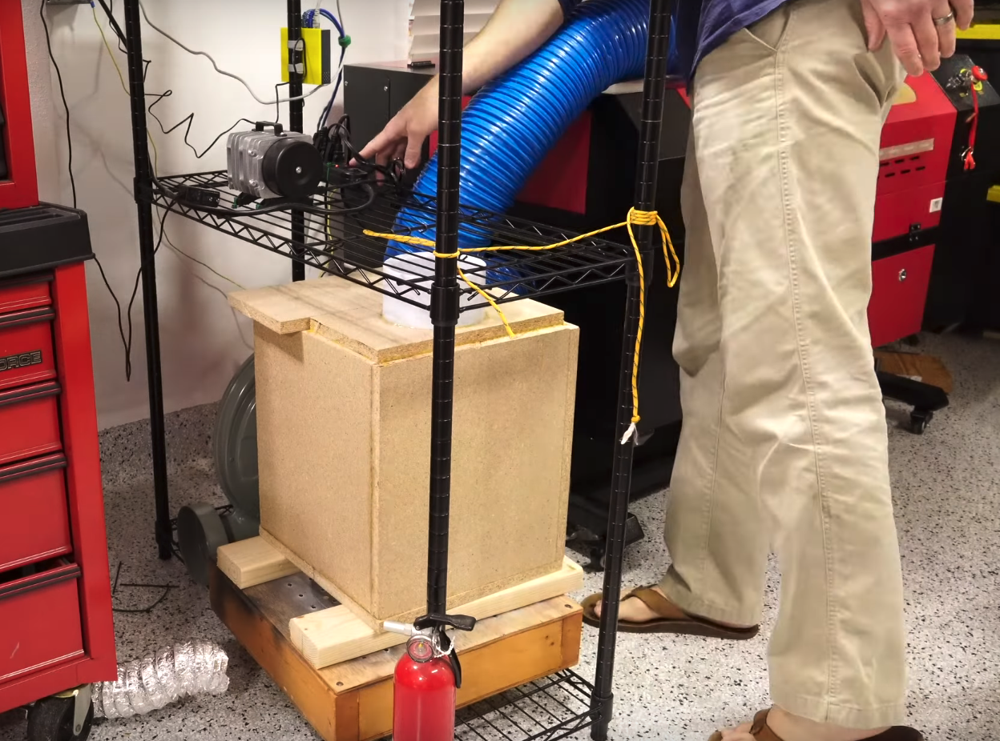

Adapter for laser Fume Extractor

**Setup is meant to exhaust outside after filtration, not to the inside an enclosed workspace**

More info on filter box available here: https://www.youtube.com/watch?v=GQHXRIHA72U  
Update using activated carbon: https://www.youtube.com/watch?v=E1zXqY-Z0s0

